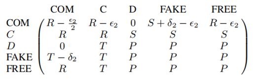

# Game-Theory-Stop-Antisocial-Punishment

## PD with Punishment

- After the PD has taken place, a player can choose to punish her opponent, which consists in paying a cost $\epsilon_1$ to make the opponent incur a cost $\delta_1$.

- Assume that $\epsilon_1<\delta_1$.

- **CP** cooperates in the PD, and punishes a co-player who defected in the game.

- AP defects in the PD, and punishes a co-player who cooperated in the game.

- **pure cooperator (C)** and **pure defector (D)** (i.e. they do not use the punishment option).

## PD with Commitment

**Commitment strategy (denoted by COM)** 

- First offer to commit, then cooperate, proposer pays cost $\epsilon_2$; 

- adversary accepts commitment but does not cooperate, compensation cost $\delta_2$;

- if does not accept commitment, interaction will not occur, both parties gain 0; 

- first assume adversary will cooperate.

**Unconditional cooperators (C)**

- always commit when being proposed a commitment deal, cooperate whenever the PD is played, but do not propose commitment themselves.

**Unconditional defectors (D)**,

- do not accept commitment, defect when the PD takes place, and do not propose commitment.

**Fake committers(FAKE),** 

- False committers, pretending to accept a commitment and then reneging on it; 
- compensated by payment of cost $\delta_2$ for accepting a promise to renege.

**Commitment free-riders (FREE)**

- defect unless being proposed a commitment, which they then accept and cooperate subsequently in the PD;
- In other words, these players are willing to cooperate when a commitment is proposed but are not prepared to pay the cost of setting it up; 
- No cooperation if you are not committed.

## PD with Punishment and Commitment

## Our work

